</br>

---

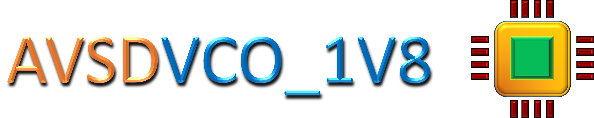

---


</br>


[](https://github.com/Nalinkumar2002/avsdvco_1v8_sky130#Specifications)


</br>

# Current Starved Voltage Controlled Oscillator (VCO)

This repository presents the design of an analog IP - *`avsdvco_1v8`* 

It is a Current Starved Voltage Controlled Oscillator targerting 180nm tech for PLL based applications.


# Table of Contents 

 * [Introduction](#Introduction)
 * [Block-Diagram](#Block-Diagram)
 * [Specifications](#Specifications)
 * [Open Source Tools Used](#Open-Source-Tools-Used)
 * [Clone This Repository](#Clone-This-Repository)
 * [Pre Layout Simulations](#Pre-Layout-Simulations)
   * [Tools And PDK Used For Pre-Layout Simulations](#Tools-and-PDK-used-for-pre-layout-simulations)
     * [Installation Of Tools And PDK](#Installation-of-Tools-and-PDK)
   * [Pre-Layout Schematics And Simulations](#Pre-layout-schematics-and-simulations)
     * [Schematics](#Schematics)
     * [Simulation](#[Simulation)
   * [Executing The Pre-Layout Simulations](#Executing-the-pre-layout-simulations)
 * [Post Layout Simulations](#Post-Layout-Simulations)
   * [Tools And PDK Used For Post-Layout Simulations](#Tools-and-PDK-used-for-post-layout-simulations)
     * [Installation Of Tools And PDK](#Installation-of-Tools-and-PDK)
   * [Post-Layout Layout Implementation And Simulations](#Post-layout-Layout-Implementation-and-Simulations)
     * [Layout](#Layout)
     * [5-Stage Ring Oscillator Layout](#5-stage-ring-oscillator-layout)
     * [Simulation](#Simulation)
   * [Extracting The Spice File](#Extracting-the-spice-file)
   * [Executing The Post-Layout Simulations](#Executing-the-post-layout-simulations)
 * [Observations](#Observations)
 * [Future Work](#Future-work)
 * [Author](#Author)
 * [Acknowledgements](#Acknowledgements)
   
   

# Introduction 

A VCO is the heart of the PLL and can be designed either by LC or RC. A LC VCOs have superior phase noise performance compared with ring VCO’S. However, an LC VCO has a small tuning range, large layout area and possibly higher power. The ring oscillators, however, do not have the complication of the on-chip inductors required for the LC oscillators. Thus the chip area is reduced and have a wide tuning range; ring oscillators with even number of delay cells can produce quadrature-phase outputs.
"Current-Starved" means that the current through the circuit is indeed limited. Lowering Vn and increasing Vp increases the effective drive resistance R<sub>eq</sub> of the inverter and thus increases the delay.The current in the first NMOS and PMOS are mirrored in each inverter/current source stage.Further tuning of oscillation frequency is done by adjusting the value of ID by changing size of bias stage transistors. Two buffer inverters are additionally used after inverter stages for preventing output loading (A
large capacitive load may affect the F<sub>osc</sub> and K<sub>vco</sub> ).


The image shown below is a 5 stage - Current Starved VCO

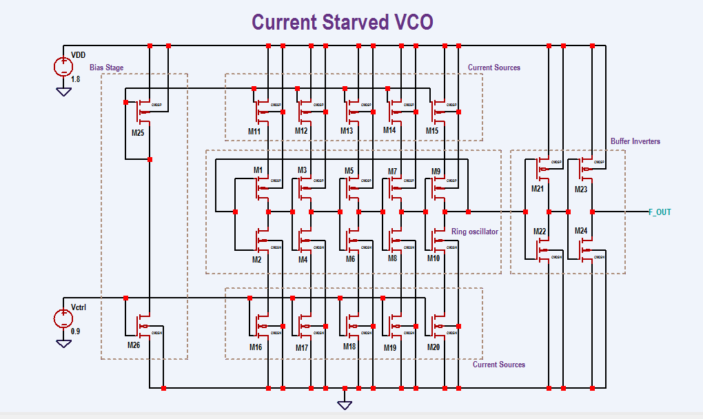

</br>

*[Back To Top](#Table-of-Contents)* ⤴️ 

</br>

# Block-Diagram

The block diagram of the proposed Current Starved VCO can be found below: </br>


<p align="center">
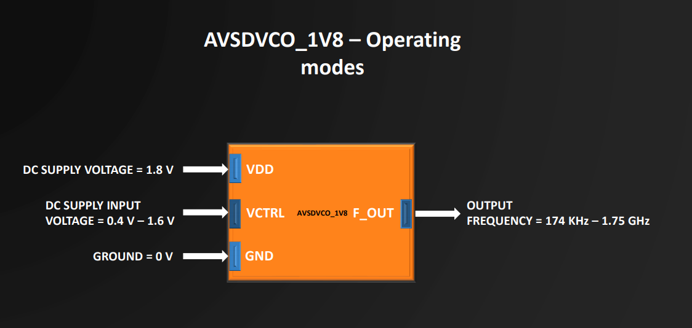
</p> 


<p align="center">
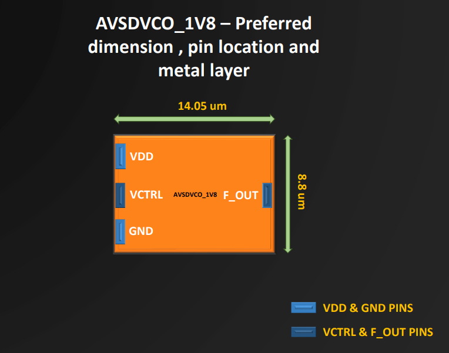
</p> 

</br>

*[Back To Top](#Table-of-Contents)* ⤴️ 

</br>

# Specifications

| Parameter                   | Symbol | Min Value | Typical Value | Max Value | Unit |
|:---------------------------:|:------:|:---------:|:-------------:|:---------:|:----:|
| Technology                  | -      | -         | 180           | -         | nm   |
| Supply Voltage              | VDD    | 1.5       | 1.8           | 2.0       | V    |
| Operating Temperature Range | T      | -40       | +27           | +85       | °C   |
| Control Voltage             | VCTRL  | 0.4       | 0.9           | 1.6       | V    |
| Output VCO Frequency        | F_OUT  | 174 K     | 907 M         | 1.75 G    | Hz   |
| Linearity                   | -      | -         | 90.28         | -         | %    |
| Power consumption           | -      | -         | 400           | -         | uW   |

 
</br>

*[Back To Top](#Table-of-Contents)* ⤴️ 

</br>
 
# Open Source Tools Used

 🌟 eSim
 
   * eSim (previously known as Oscad / FreeEDA) is a free/libre and open source EDA tool for circuit design, simulation, analysis and PCB design. It is an integrated tool built    using free/libre and open source software such as KiCad, Ngspice and GHDL. eSim is released under GPL.It can serve as an alternative to commercially available/licensed software tools like OrCAD, Xpedition and HSPICE.

        🔗 https://esim.fossee.in/home
 
 🌟 Ngspice
 
   * Ngspice is a mixed-level/mixed-signal electronic circuit simulator.
   * Ngspice is based on three open-source free-software packages: 
      * Spice3f5
      * Xspice
      * Cider1b1
   
      🔗 http://ngspice.sourceforge.net/
        
 🌟 Sky130 PDK
 
   * The SKY130 is a mature 180nm-130nm hybrid technology originally developed internally by Cypress Semiconductor before being spun out into SkyWater Technology and made accessible to general industry. SkyWater and Google’s collaboration is now making this technology accessible to everyone.
   * The SKY130 Process Node is an extremely flexible offering, including many normally optional features as standard (features like the local interconnect, SONOS functionality, MiM capacitors, and more). This provides the designer with a wide range of flexibility in design choices.
   
     🔗 https://github.com/google/skywater-pdk
   
 🌟 Magic
 
  * Magic is a venerable VLSI layout tool, written in the 1980's at Berkeley by John Ousterhout, now famous primarily for writing the scripting interpreter language Tcl. Due largely in part to its liberal Berkeley open-source license, magic has remained popular with universities and small companies.
  * The open-source license has allowed VLSI engineers with a bent toward programming to implement clever ideas and help magic stay abreast of fabrication technology. However, it is the well thought-out core algorithms which lend to magic the greatest part of its popularity.
  * Magic is widely cited as being the easiest tool to use for circuit layout, even for people who ultimately rely on commercial tools for their product design flow.
  
    🔗 http://opencircuitdesign.com/magic/

</br>

*[Back To Top](#Table-of-Contents)* ⤴️ 
</br>

# Clone This Repository 

  * Clone this repository using git clone command 
 
 ```
 $ git clone https://github.com/Nalinkumar2002/avsdvco_1v8.git
```

</br>

*[Back To Top](#Table-of-Contents)* ⤴️ 

</br>

# Pre Layout Simulations

## Tools And PDK Used For Pre-Layout Simulations
  * eSim
  * Ngspice
  * Skywater130 PDK
  
### Installation Of Tools And PDK

📥 eSim:
 
  * Install the eSim tool using this website given below.
  
     🔗 https://esim.fossee.in/downloads
   
  *  You can also refer to the eSim Spoken Tutorial.
  
     🔗 https://spoken-tutorial.org/tutorial-search/?search_foss=eSim
     
📥 Ngspice :
 
  * Install Ngspice using this website given below.

    🔗 http://ngspice.sourceforge.net/download.html
   
📥 Sky130 PDK :  
 
   * Use git clone method  
   
    $ git clone https://foss-eda-tools.googlesource.com/skywater-pdk/libs/sky130_fd_pr
   
 > Place `sky130_fd_pr` folder in current working directory to avoid errors during simulations.
 

## Pre-Layout Schematics And Simulations 

### Schematics 

Current Starved VCO is designed using eSim and the screenshot of schematic file is shown below

<p align="center">
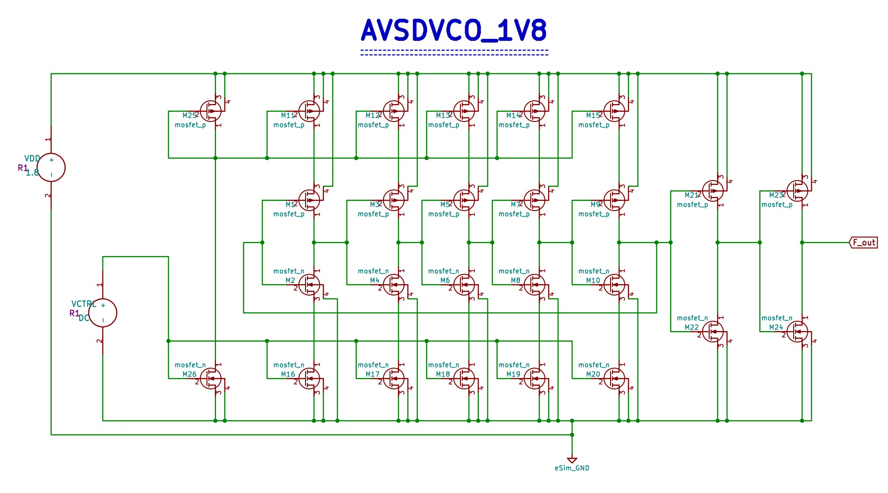
</p>

### Simulation

After creating the schematics, spice netlist was extracted with the help of esim and the necessary model files of *sky130 tt*  transistors were included in the netlist and transient analysis was performed.

The result of transient analysis of VCO @ `vctrl = 0.9 V` is shown below

<p align="center">
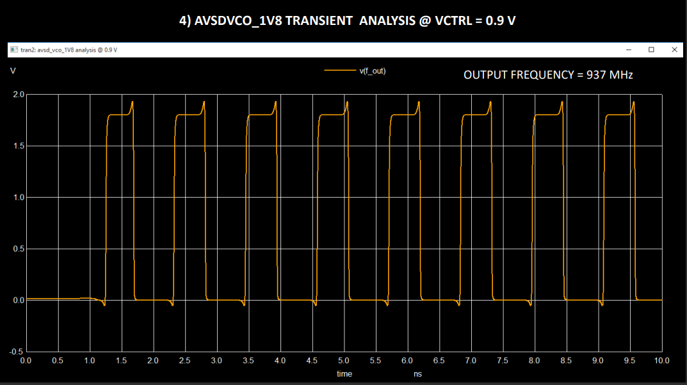
</p>


📢 Output frequency of VCO `F_out = 937 MHz`


🔶 Transient analysis is performed for different control voltages and output frequencies are tabulated for corresponding control voltage and graphs are plotted .

 <p align="center">
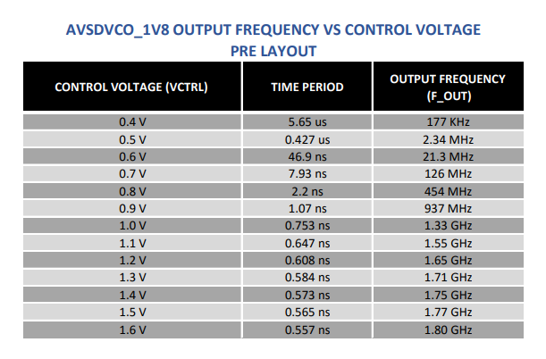
</p>

<p align="center">
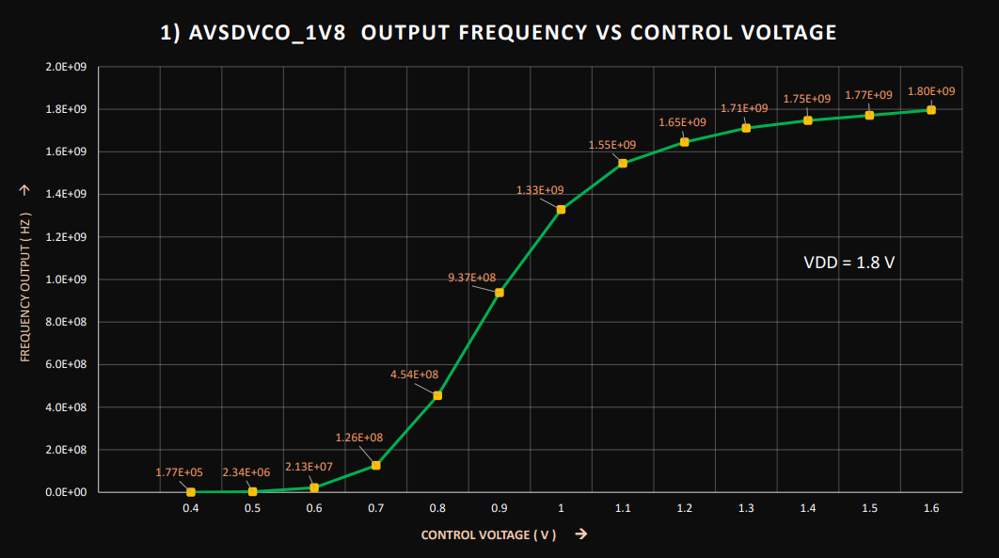
</p>


🔶 Similarly, transient analysis is performed for different plots 

*  ✔️ AVSDVCO_1V8 BIAS CURRENT VS CONTROL VOLTAGE   
*  ✔️ AVSDVCO_1V8 OUTPUT FREQUENCY VS BIAS VOLTAGE 

 </br>

💠 AVSDVCO_1V8 BIAS CURRENT VS CONTROL VOLTAGE

<p align="center">
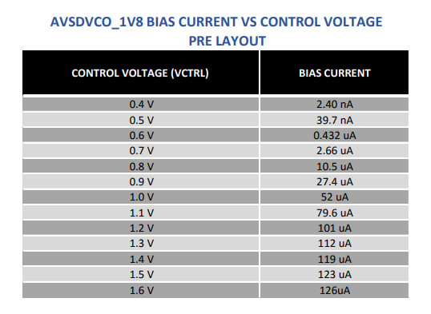
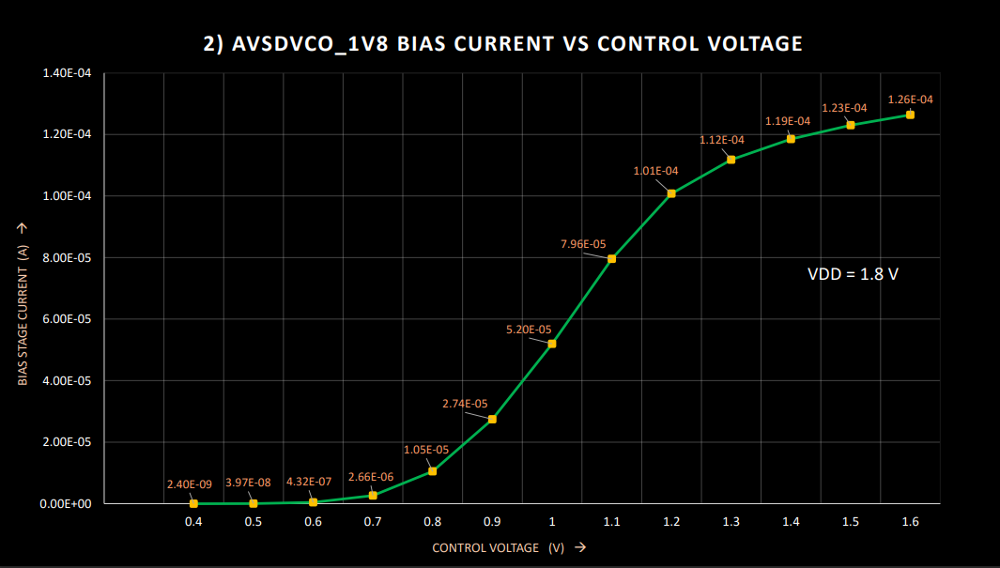
</p>


💠 AVSDVCO_1V8 OUTPUT FREQUENCY VS BIAS VOLTAGE

<p align="center">
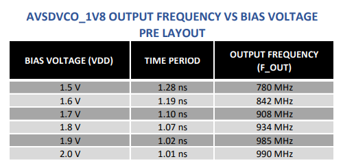
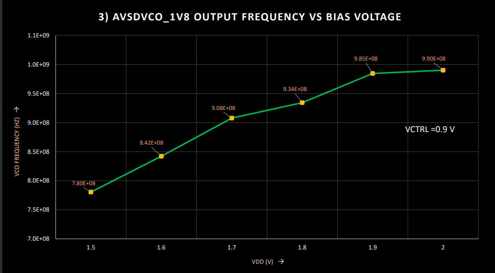
</p>

 ## Executing The Pre-Layout Simulations
 
  * Change directory using command
 
 ``` 
  $ cd Pre_Layout_Simulations
 ```
  * Run the `avsdvco_1v8_pre_layout.cir.out` file in ngspice to perform simulations
 
 ``` 
 $ ngpice avsdvco_1v8_pre_layout.cir.out
 ```
 * Output graphs are displayed on the screen after the execution .
 * To perform various transient analysis follow the `README.txt` given in that directory or please find it below by clicking README.txt
 
 
<details>
<summary>README.txt</summary>
  
```
 ==================================== 
 IP Name :avsdvco_1V8
 PDK : Sky130 PDK by Google SkyWater
 ==================================== 
 ~~~~~~~~~~~~~~~~~~~~~~~~~~~~~~~~~~~
  Name of the author : NALINKUMAR S 
 ~~~~~~~~~~~~~~~~~~~~~~~~~~~~~~~~~~~

 --------------------------------->
 To perform Pre-Layout Simulations 
 --------------------------------->
 	
 --> In file "avsdvco_1v8_pre_layout.cir.out" change the control voltage and transient command to get output for various control voltages.
 --> To get outputs at different control voltages change the transient command according to control voltages given below for perfect output graphs
 
 ---------------------------------------------------
  VCTRL (Control Voltage) |    Transient command
 ---------------------------------------------------
	0.4 V   	  |	tran 10ns 100us
	0.5 V		  |	tran 1ns 5us
	0.6 V		  |	tran 100ps 500ns
	0.7 V		  |	tran 10ps 50ns
	0.8 V		  |	tran 10ps 20ns
	0.9 V  		  |	tran 1ps 10ns
	1.0 V		  |	tran 1ps 5ns
	1.1 V		  |	tran 1ps 5ns
	1.2 V		  |	tran 1ps 5ns
	1.3 V		  |	tran 1ps 5ns
	1.4 V		  |	tran 1ps 5ns
	1.5 V		  |	tran 1ps 5ns
	1.6 V		  |	tran 1ps 5ns
	
 *Note: -> Before performing simulations keep the " sky130_fd_pr " folder in current working directory to avoid errors.
 	-> To get output frequency vs bias voltage plot varry VDD from 1.5 V to 2.0 V @ VCTRL = 0.9 V


 --> After performing all analysis the values are tabulated and output graphs are ploted :
	
	TABLES:
	-------
	-> AVSDVCO_1V8 OUTPUT FREQUENCY VS CONTROL VOLTAGE - avsdvco_1v8_pre_layout_table_1.png
	-> AVSDVCO_1V8 BIAS CURRENT VS CONTROL VOLTAGE - avsdvco_1v8_pre_layout_table_2.png	
	-> AVSDVCO_1V8 OUTPUT FREQUENCY VS BIAS VOLTAGE - avsdvco_1v8_pre_layout_table_3.png
	
	PLOTS:
	------
	-> AVSDVCO_1V8 OUTPUT FREQUENCY VS CONTROL VOLTAGE - avsdvco_1v8_pre_layout_output_1.png
	-> AVSDVCO_1V8 BIAS CURRENT VS CONTROL VOLTAGE - avsdvco_1v8_pre_layout_output_2.png	
	-> AVSDVCO_1V8 OUTPUT FREQUENCY VS BIAS VOLTAGE - avsdvco_1v8_pre_layout_output_3.png
	-> AVSDVCO_1V8 TRANSIENT ANALYSIS @ VCTRL = 0.9 V - avsdvco_1v8_pre_layout_output.png   
  
```
</details>
  
 </br>

*[Back To Top](#Table-of-Contents)* ⤴️ 

</br>
  
 # Post Layout Simulations

## Tools And PDK Used For Post-Layout Simulations
  * Magic
  * Ngspice
  * Skywater130 PDK
  * Sky130A Tech file
  
### Installation Of Tools And PDK


📥 Magic :
 
  * To install magic follow the steps below 
 </p>
 
        $ sudo wget `http://opencircuitdesign.com/magic/archive/magic-8.3.122.tgz`
</p>

        $ tar -xvzf magic-8.3.122.tgz
</p>

        $ cd magic-8.3.122
</p>

        $ sudo ./configure
</p>

        $ sudo make
</p>

        $ sudo make install
     
     
📥 Ngspice :
 
  * Install Ngspice using this website given below.

    🔗 http://ngspice.sourceforge.net/download.html
    
📥 Sky130A Tech file : 
 
  * Download `Sky130A Tech `file in `Layout_Files` folder in this repository and place it in current working directory.
   
📥 Sky130 PDK :  
 
   * Use git clone method  
   
    $ git clone https://foss-eda-tools.googlesource.com/skywater-pdk/libs/sky130_fd_pr
   
 > Place `sky130_fd_pr` folder in current working directory to avoid errors during simulations.

## Post-Layout Layout Implementation And Simulations 

### Layout

Layout of VCO is implemented using magic tool and screenshot of layout is shown below

<p align="center">
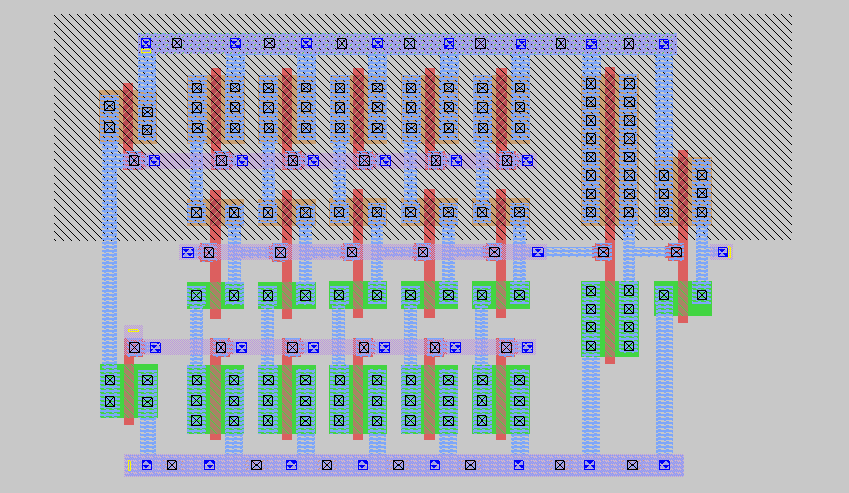
</p>

#### 5-Stage Ring Oscillator Layout 

<p align="center">
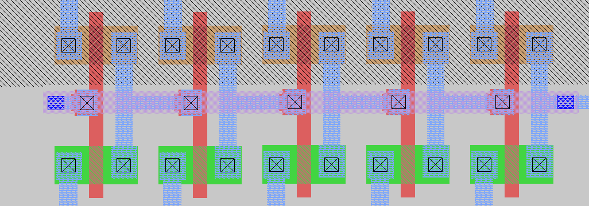
</p>


### Simulation

After the layout implementation, spice netlist was extracted and the necessary model files of *sky130 tt*  transistors were included in the netlist and transient analysis was performed.

The result of transient analysis of VCO @ `vctrl = 0.9 V` is shown below

<p align="center">
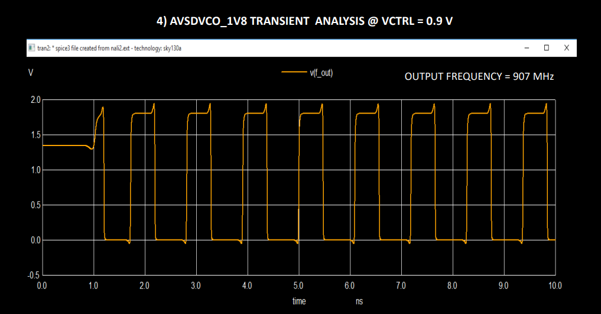
</p>


📢 Output frequency of VCO `F_out = 907 MHz`


🔶 Transient analysis is performed for different control voltages and output frequencies are tabulated for corresponding control voltage and graphs are plotted .

 <p align="center">
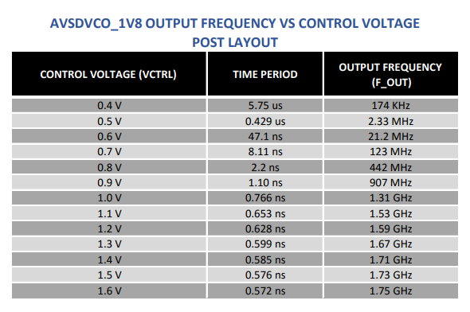
</p>

<p align="center">
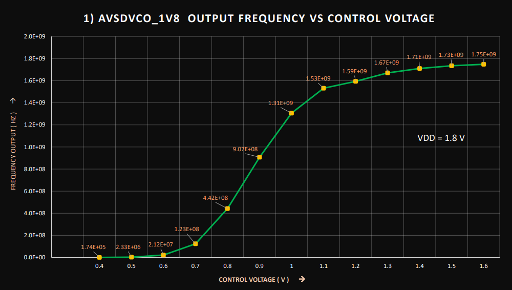
</p>


🔶 Similarly, transient analysis is performed for different plots 

 *  ✔️ AVSDVCO_1V8 BIAS CURRENT VS CONTROL VOLTAGE   
 *  ✔️ AVSDVCO_1V8 OUTPUT FREQUENCY VS BIAS VOLTAGE 
  
 </br>
 
💠 AVSDVCO_1V8 BIAS CURRENT VS CONTROL VOLTAGE

<p align="center">
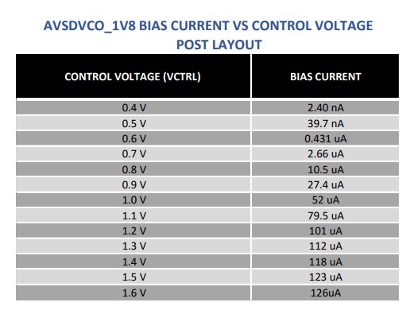

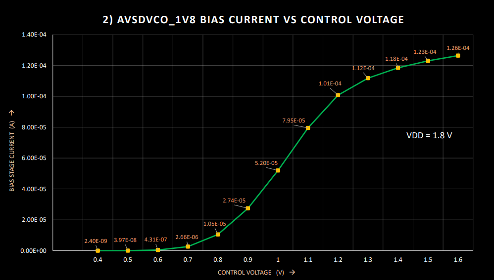
</p>


💠 AVSDVCO_1V8 OUTPUT FREQUENCY VS BIAS VOLTAGE

 <p align="center">
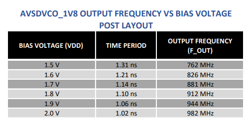

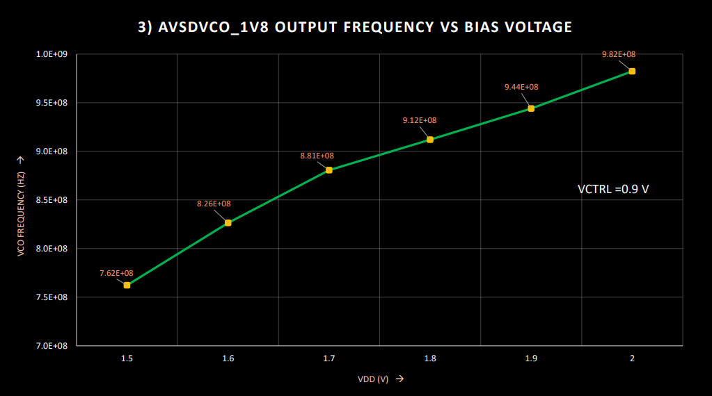
</p>

 ## Extracting The Spice File
 
  * To Change directory using command
 
 ``` 
  $ cd Layout_Files
 ```
  * To open magic tool
  
```
 $ magic -T sky130A.tech
```
 * To open `avsdvco_1v8.mag` file , Select *File --> Open --> avsdvco_1v8.mag*
 
 * To extract spice file , Type the following commands in magic commmand window
</p>

        % save <file-name>
</p>

        % extract all
</p>

        % ext2spice
        
  * Spice file will be created in current working directory and necessary changes are done to .spice file and saved as `avsdvco_1v8_test.spice`

> Note: The `avsdvco_1v8_test.spice` file later renamed to `avsdvco_1v8_post_layout.cir.out` in `Post_Layout_Simulations` directory for easy access.
  
  
 ## Executing The Post-Layout Simulations
 

  * To Change directory using command
 
 ``` 
  $ cd Post_Layout_Simulations
 ```
  * Run the `avsdvco_1v8_post_layout.cir.out` file in ngspice to perform simulations
 
 ``` 
 $ ngpice avsdvco_1v8_post_layout.cir.out
 ```
 * Output graphs are displayed on the screen after the execution .
 * To perform various transient analysis follow the `README.txt` given in that directory or please find it below by clicking README.txt

<details>
<summary>README.txt</summary>
  
```
 ==================================== 
 IP Name :avsdvco_1V8
 PDK : Sky130 PDK by Google SkyWater
 ==================================== 
 ~~~~~~~~~~~~~~~~~~~~~~~~~~~~~~~~~~~
  Name of the author : NALINKUMAR S 
 ~~~~~~~~~~~~~~~~~~~~~~~~~~~~~~~~~~~

 --------------------------------->
 To perform Post-Layout Simulations 
 --------------------------------->
 	
 --> In file "avsdvco_1v8_post_layout.cir.out" change the control voltage and transient command to get output for various control voltages.
 --> To get outputs at different control voltages change the transient command according to control voltages given below for perfect output graphs
 
 ---------------------------------------------------
  VCTRL (Control Voltage) |    Transient command
 ---------------------------------------------------
	0.4 V   	  |	tran 10ns 100us
	0.5 V		  |	tran 1ns 5us
	0.6 V		  |	tran 100ps 500ns
	0.7 V		  |	tran 10ps 50ns
	0.8 V		  |	tran 10ps 20ns
	0.9 V  		  |	tran 1ps 10ns
	1.0 V		  |	tran 1ps 5ns
	1.1 V		  |	tran 1ps 5ns
	1.2 V		  |	tran 1ps 5ns
	1.3 V		  |	tran 1ps 5ns
	1.4 V		  |	tran 1ps 5ns
	1.5 V		  |	tran 1ps 5ns
	1.6 V		  |	tran 1ps 5ns
	
 *Note: -> Before performing simulations keep the " sky130_fd_pr " folder in current working directory to avoid errors.
 	-> To get output frequency vs bias voltage plot varry VDD from 1.5 V to 2.0 V @ VCTRL = 0.9 V

 --> After performing all analysis the values are tabulated and output graphs are ploted :
	
	TABLES:
	-------
	-> AVSDVCO_1V8 OUTPUT FREQUENCY VS CONTROL VOLTAGE - avsdvco_1v8_post_layout_table_1.png
	-> AVSDVCO_1V8 BIAS CURRENT VS CONTROL VOLTAGE - avsdvco_1v8_post_layout_table_2.png	
	-> AVSDVCO_1V8 OUTPUT FREQUENCY VS BIAS VOLTAGE - avsdvco_1v8_post_layout_table_3.png
	
	PLOTS:
	------
	-> AVSDVCO_1V8 OUTPUT FREQUENCY VS CONTROL VOLTAGE - avsdvco_1v8_post_layout_output_1.png
	-> AVSDVCO_1V8 BIAS CURRENT VS CONTROL VOLTAGE - avsdvco_1v8_post_layout_output_2.png	
	-> AVSDVCO_1V8 OUTPUT FREQUENCY VS BIAS VOLTAGE - avsdvco_1v8_post_layout_output_3.png
	-> AVSDVCO_1V8 TRANSIENT ANALYSIS @ VCTRL = 0.9 V - avsdvco_1v8_post_layout_output.png   
  
```
</details>

</br>

*[Back To Top](#Table-of-Contents)* ⤴️ 

</br>

# Observations

 🏷️   Maximum frequency of VCO achieved for pre-layout simulations `F_OUT = 1.8 GHz` @ vctrl= 1.6 V
 
 🏷️   Maximum frequency of VCO achieved for post-layout simulations `F_OUT = 1.75 GHz` @ vctrl= 1.6 V
 
 🏷️   VCO frequency increases (F_OUT) when control voltage (VCTRL) is being increased for both pre-layout and post-layout simulations.
 
 🏷️   Bias current increases (I_BIAS) when control voltage (VCTRL) is being increased for both pre-layout and post-layout simulations.
 
 🏷️   Vco output frequency (F_OUT) increases when Bias voltage (VDD) is being increased for both pre-layout and post-layout simulations.
 
 🏷️   During pre-layout simulations, the output frequency of the VCO is dependent about `90.46 %` linearly on control voltage.
 
 🏷️   During post-layout simulations, the output frequency of the VCO is dependent about `90.28 %` linearly on control voltage.
 
 🏷️   Power consumption of circuit after layout implementation @ `Frequency = 907 MHz` with `50 ohm` load  = `400 uW` 
 
 </br>

*[Back To Top](#Table-of-Contents)* ⤴️ 

</br>
 
# Future Work 

  🏁 Linearity of the VCO can be increased.
 
  🏁 Tuning range of VCO can be increased further.
 
 # Author
 
  🖊️ Nalinkumar S , B.E (Electronics and Communication Engineering), Madras Institute of Technology, Anna University, Tamil Nadu 
 
 
 # Acknowledgements

 📖 Kunal Ghosh, Co-Founder of VLSI System Design (VSD) Corp. Pvt. Ltd. - kunalpghosh@gmail.com

---
